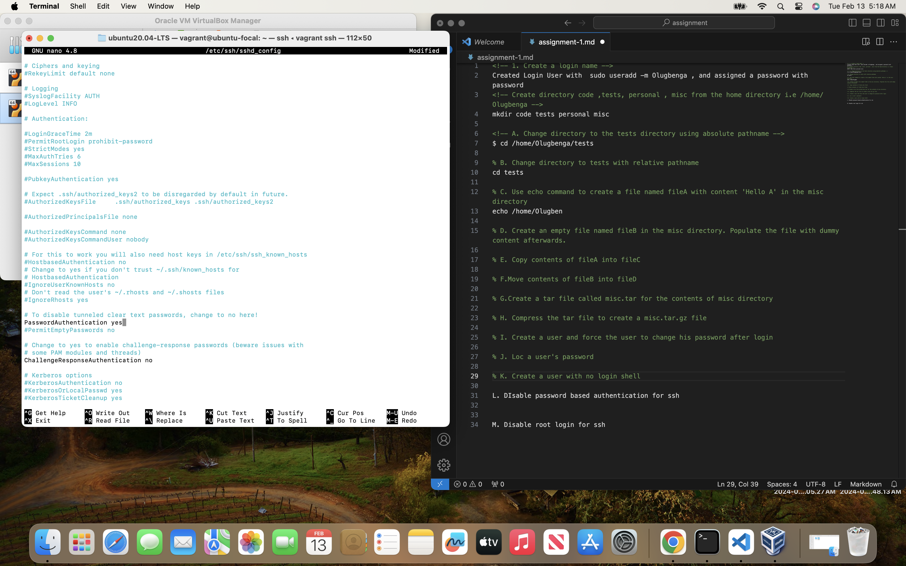

<!-- 1. Create a login name -->
Created Login User with  sudo useradd -m Olugbenga , and assigned a password with password 

<!-- Create directory code ,tests, personal , misc from the home directory i.e /home/Olugbenga -->
mkdir code tests personal misc

<!-- A. Change directory to the tests directory using absolute pathname -->
<!-- $ cd /home/Olugbenga/tests -->

<!-- % B. Change directory to tests with relative pathname -->
cd tests

<!-- % C. Use echo command to create a file named fileA with content 'Hello A' in the misc directory -->

% D. Create an empty file named fileB in the misc directory. Populate the file with dummy content afterwards.
<!-- % C. Use echo command to create a file named fileA with content 'Hello A' in the misc directory -->

<!-- % E. Copy contents of fileA into fileC -->

<!-- % F.Move contents of fileB into fileD -->

<!-- % G.Create a tar file called misc.tar for the contents of misc directory -->

<!-- % H. Compress the tar file to create a misc.tar.gz file -->

% I. Create a user and force the user to change his password after login

<!-- % J. Loc a user's password -->

<!-- % K. Create a user with no login shell -->

% L. DIsable password based authentication for ssh

M. Disable root login for ssh
