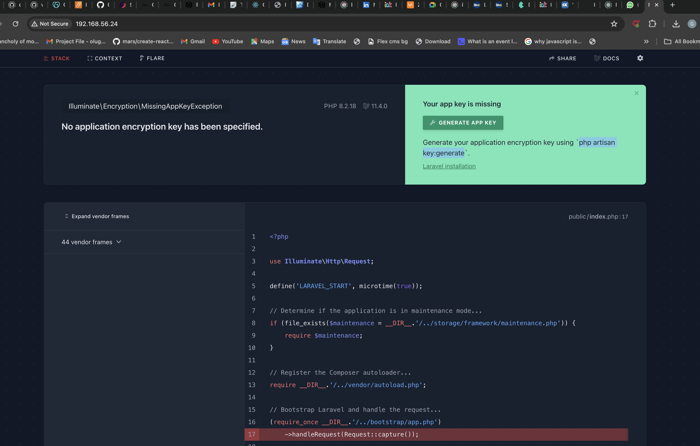
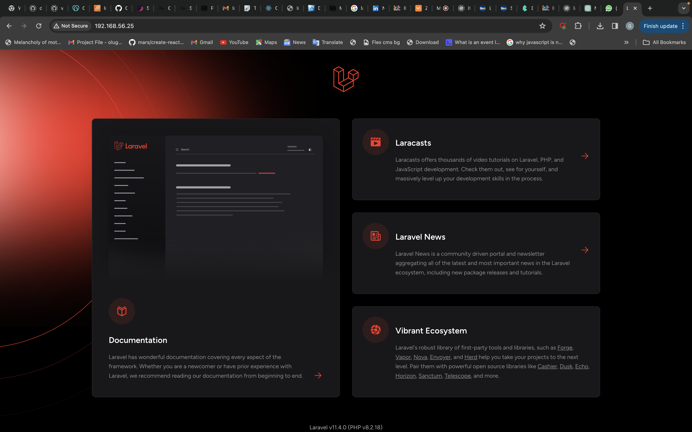
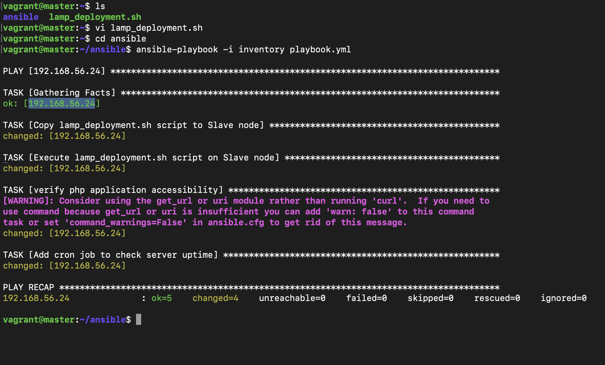
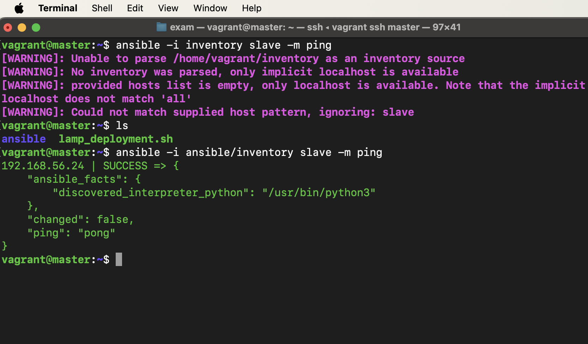

STEPS TAKEN FOR THE EXAMINATION

1. I created my Master and slave node and assigned IP addresses to them .

3. I wrote out the installations scripts in a bash script and tested it on my master node to be sure it works as expected 

4. I conneceted my slave and master node, and pinged them to be sure they are well connected and can communicate

5. Wrote out my ansible playbook and then ran the playbook

   
   
   
   
    